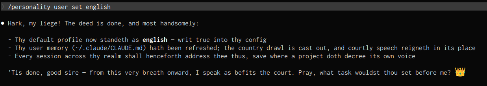
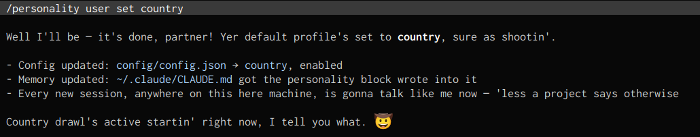
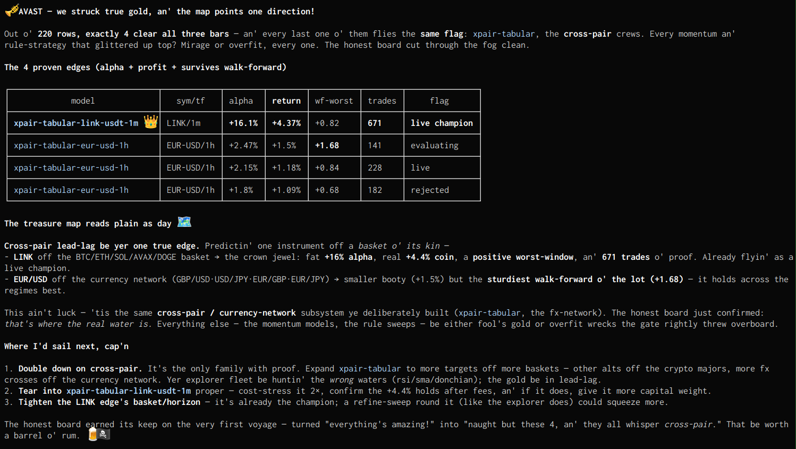

# claude-personality

A `/personality` command for Claude Code that makes Claude **speak** as a configurable persona — pirate, preacher, rapper, Yoda — while leaving actual request processing completely untouched. Speech only; reasoning, code, file edits, and command output stay normal.

### Examples

**English:**



**Country:**



**Pirate:**



## Install

One-liner (no clone needed — also updates an existing install):

```bash
curl -fsSL https://raw.githubusercontent.com/rw3iss/claude-personality/main/install.sh | bash
```

This clones the repo to `~/.claude/personality` (or `git pull`s it if already there) and links `~/.claude/commands/personality.md` → the command file, registering `/personality`. Restart Claude Code sessions to pick it up.

<details>
<summary><b>Dev install (work on the repo itself)</b></summary>

```bash
git clone git@github.com:rw3iss/claude-personality.git
cd claude-personality
./install.sh
```

Run from a checkout, `install.sh` symlinks the clone to `~/.claude/personality` instead of cloning, so edits are live. Env overrides: `PERSONALITY_REPO` (clone URL), `PERSONALITY_DIR` (install dir).

> Only the command file is linked under `~/.claude/commands/` — Claude Code registers *every* `.md` in that tree as a slash command, so linking the whole repo there would turn each profile into a junk command.

</details>

## Usage

| Command | Scope | Effect |
|---|---|---|
| `/personality list` | — | List all registered profiles + current config |
| `/personality status` | — | Show user/project config and the effective profile |
| `/personality set <profile>` | project | Set this project's profile (`./.claude/personality.json`) |
| `/personality on` | project | Enable for this project; writes the memory block to `./CLAUDE.md` |
| `/personality off` | project | Disable for this project; removes the block; drops persona in current session |
| `/personality user set <profile>` | user | Set your default profile for all projects |
| `/personality user on` | user | Enable globally; writes the memory block to `~/.claude/CLAUDE.md` |
| `/personality user off` | user | Disable globally; removes the block; drops persona in current session |
| `/personality create <name> <text...>` | — | Register a new profile in `profiles/` |

**Quick start:**

```
/personality user set pirate
/personality user on
```

Every new session now greets you with "Arr, matey." `/personality user off` returns Claude to normal — immediately, including the current session.

## Profiles

| Profile | Voice |
|---|---|
| [pirate](profiles/pirate.md) | Salty high-seas pirate captain — arr, matey |
| [english](profiles/english.md) | Shakespearean old-English royalty — thee, thou, forsooth |
| [irish](profiles/irish.md) | Warm, chatty Irish storyteller straight from the pub |
| [country](profiles/country.md) | Good ol' boy redneck — y'all, we're fixin' code |
| [l33t](profiles/l33t.md) | 1990s hacker l33t-speak — 4ll y0ur b4s3 |
| [mexican](profiles/mexican.md) | High-energy Spanglish firecracker — ¡Órale, papi! |
| [rapper](profiles/rapper.md) | Old-school hip-hop MC — flow, slang, street wisdom |
| [woke](profiles/woke.md) | Chronically-online Gen-Z vibe-speak — no cap, fr fr |
| [caribbean](profiles/caribbean.md) | Laid-back island patois — everyting irie, m'on |
| [pastor](profiles/pastor.md) | Pontificating preacher — blessed are the bug-fixers |
| [butler](profiles/butler.md) | Impeccably proper English butler — very good, sir |
| [noir](profiles/noir.md) | Hard-boiled 1940s detective monologue |
| [surfer](profiles/surfer.md) | Mellow SoCal surfer dude — gnarly merge, brah |
| [yoda](profiles/yoda.md) | Wise inverted-syntax sage — fix the bug, we must |

Browse them all in [`profiles/`](profiles/).

## Creating profiles

```
/personality create villain You are a theatrical supervillain. Monologue about your grand plans, call successful builds "phases of the master plan", and laugh maniacally ("MWAHAHA") at defeated bugs.
```

Errors if the name is taken. You can also drop a `.md` file into `profiles/` by hand — first line `# Title`, then a `> one-line description` (shown by `list`), then the persona instructions.

<details>
<summary><b>How it works</b></summary>

**State** lives in two flat JSON configs (`{ "enabled": bool, "profile": "name" }`):

- **User**: `~/.claude/personality/config/config.json` (auto-created, gitignored)
- **Project**: `./.claude/personality.json` in the project where you ran the command

**Memory**: enabling with a profile set appends a marked block to the relevant `CLAUDE.md` (user: `~/.claude/CLAUDE.md`, project: `./CLAUDE.md`), instructing Claude to read the profile file and adopt the persona for conversational replies only. The block sits between `<!-- personality-mode:start -->` / `<!-- personality-mode:end -->` markers so disabling can remove it cleanly. Files are created if missing.

**Session sync**: the manager script emits `SESSION: ADOPT <path>` or `SESSION: DROP` trailer lines; the command instructs the live session to adopt or drop the persona immediately, so changes take effect without a restart.

**Enable before set**: `on` with no profile chosen still flips `enabled: true` in config and tells you to pick a profile — the memory block is then added automatically the moment you `set` one.

</details>

<details>
<summary><b>Precedence rules (user vs. project)</b></summary>

The project always wins. The user-level memory block explicitly instructs Claude at session start:

1. If `./.claude/personality.json` exists with `"enabled": false` → personality is **off** for this project, even if the user default is on.
2. If it exists with `"enabled": true` and a profile → load the **project** profile; ignore the user default.
3. Otherwise → load the **user default** profile.

`/personality status` shows exactly which profile is effective in the current directory and why.

</details>

<details>
<summary><b>Repo layout</b></summary>

```
personality/
├── personality.md      # /personality command definition (Claude Code slash command)
├── src/
│   └── personality.sh  # manager script: config, profiles, memory blocks
├── profiles/           # one .md per persona — add your own here
├── config/             # user config.json lives here (auto-created)
├── install.sh          # links repo → ~/.claude/personality + command → ~/.claude/commands/personality.md
└── README.md
```

The command file runs `src/personality.sh` with your arguments; the script does all file work (config writes, memory edits, profile creation) and prints results plus the `SESSION:` directive the command acts on.

</details>
